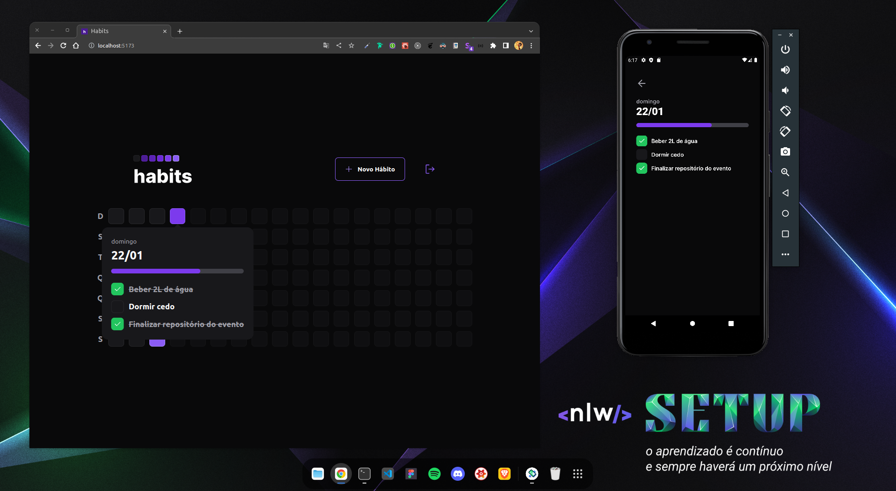

# NLW SETUP

Criação de aplicação Web, Mobile e Server chamada Habit.

## Sobre o projeto

Projeto criado durante o evento NLW Setup, criado pela Rocketseat. 

### Tecnologias usadas

- Backend
  - Node.js
  - Prisma
  - Fastify

- Web
  - ReactJS
  - Vite
  - Tailwind
  - dayjs
  - Radix UI

- Mobile
  - React Native
  - React Navigation
  - Tailwind
  - dayjs
  - React native Reanimated

- **Extra**
  - Firebase (web e mobile)
